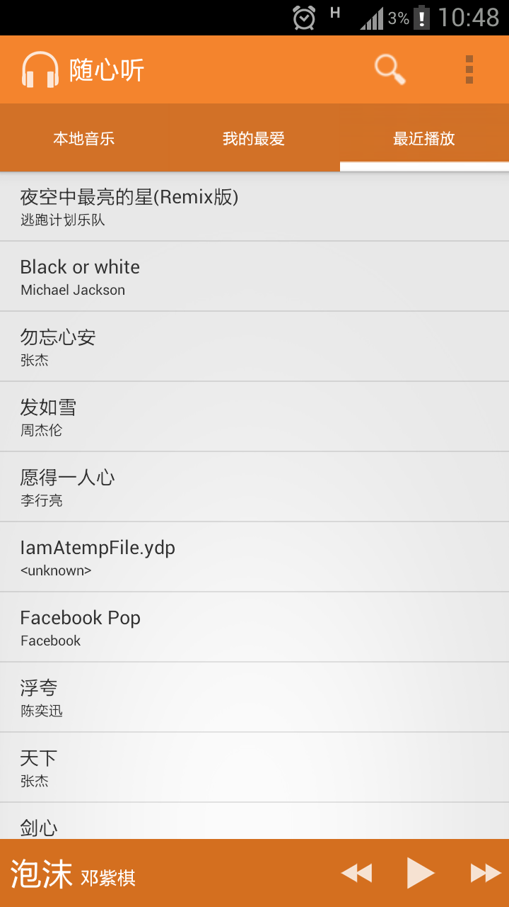

一个android音乐播放器
---
###预期功能：

- 人性化的界面
- 检索本地的音乐文件，添加到播放列表中
- 实现播放本地音乐文件
- 加载并播放网络音乐
- 添加一定的社交元素(分享功能等)

###进度报告：

- 2014-11-02: actionbar自定义，actionbarTab自定义，tab间点击切换
- 2014-11-10: actionbarTab 滑动
- 2014-11-21: 播放栏常驻底部
- 2014-12-02: 完成列表项的定义和ListFragment适配器(由于viewpager的原因，现将ListFragment实现改为Fragment+ListView来分开实现)
- 2014-12-03: 使用FragmentPagerAdapter代替PagerAdapter重构代码
- 2014-12-04: 获取手机sdcard中所有音频信息(ContentProvider,从系统提供的MediaStore中获取)
- 2014-12-04: 实现每个标签页下的fragment(各有一个ListView)
- 2014-12-05: 优化底部播放栏(将播放，上/下一曲Button改为ImageButton来实现)
- 2014-12-05: 实现点击不同列表项播放对应的音乐

    - 

- 2014-12-07: 播放按钮点击切换(开始/暂停)，底部播放栏播放按钮控制音乐的播放暂停并与歌曲列表的点击事件同步。
- 2014-12-07: 播放栏显示歌曲信息的textview与列表项的选择同步，当歌曲信息较长时，横向滚动显示
- 2014-12-08: 播放栏上/下一曲功能
- 2014-12-08: 曲目标星功能(曲目标爱心并在'我喜欢'标签下显示)
- 2014-12-10: 完成artists(艺术家)列表并优化表项

...
